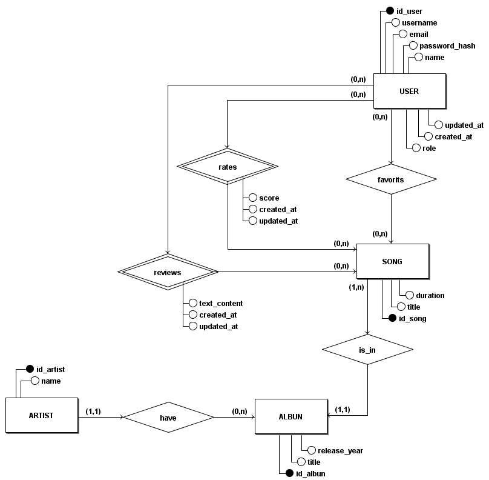
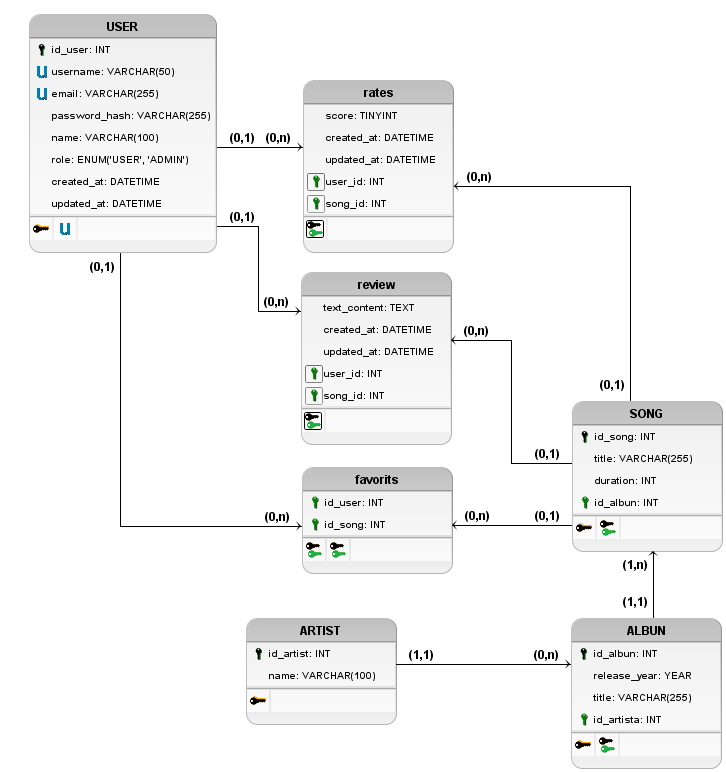

# Banco de Dados

## Modelo Entidade-Relacionamento (MER)

### IDENTIFICAÇÃO DAS ENTIDADES

- USER
- ARTIST    
- ALBUM     
- SONG      
- PLAYLIST  

### DESCRIÇÃO DAS ENTIDADES (ATRIBUTOS)
- **USER** (__id_user__, username, email, password_hash, name, role, updated_at, created_at)
- **ARTIST** (__id_artist__, name)
- **ALM** (__id_album__, title, release_year)
- **SONG** (__id_song__, title, duration)
- **PLAYLIST** (__id_playlist__, name)

### DESCRIÇÃO DOS RELACIONAMENTOS

ARTIST — **have** — ALBUM

    Um ARTIST have (possui) um ou mais ALBUM. Um ALBUM have(pertence a) um ou mais ARTIST.
    Cardinalidade: (N,N)

    Tabela Associativa: ARTIST_HAVE_ALBUM(id_artist, id_album)

ALBUM — **is_in** — SONG

    Um ALBUM is_in (contém) um ou mais SONG. Um SONG is_in apenas um ALBUM.
    Cardinalidade: (1,N)

USER — **rates** — SONG

    Um USER pode avaliar (rates) muitos SONG. Um SONG pode ser avaliado (rates) por muitos USER. 
    Cardinalidade: (N,N)

    Tabela Associativa: RATES(id_user, is_song, score, created_at, updated_at)
    
USER — **reviews** — SONG

    Um USER pode escrever reviews sobre muitos SONG. Um SONG pode ter reviews de muitos USER.
    Cardinalidade: (N,N)

    Tabela Associativa: REVIEWS(id_user, id_song,text_content, created_at, updated_at)

USER — **favorites** — SONG

    Um USER pode ter muitos SONG como favoritos. Um SONG pode ser favorito de muitos USER.
    Cardinalidade: (N,N)

    Tabela Associativa: USER_FAVORITES_SONG(id_user, id_song)

USER — **have** — PLAYLIST

    Um USER pode have (possuir) muitas PLAYLIST. Uma PLAYLIST have (pertence a) apenas um USER.
    Cardinalidade: (1,N)

PLAYLIST — **have** — SONG

    Uma PLAYLIST have (contém) muitos SONG. Um SONG pode estar em muitas PLAYLIST.
    Cardinalidade: (N,N)

    Tabela Associativa: PLAYLIST_HAVE_SONG(id_playlist, id_song)

## Diagrama Entidade-Relacionamento (DER)

## Diagrama Lógico de Dados (DLD)

