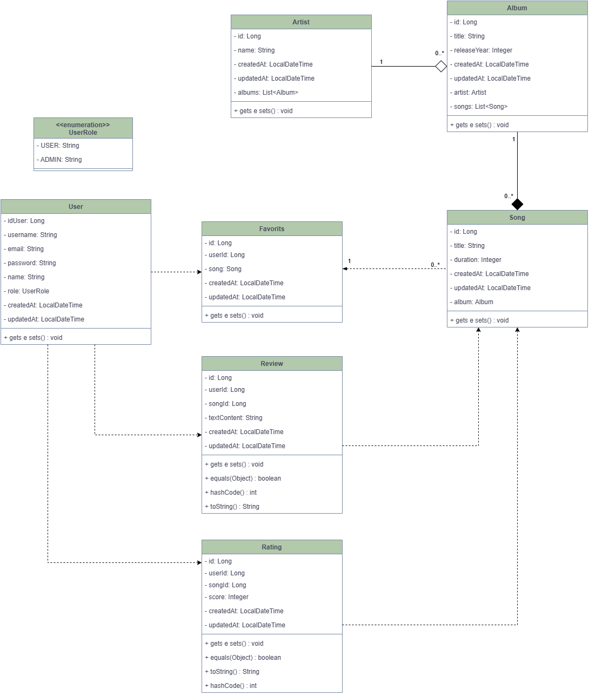

# Diagrama UML

## Diagrama de Classes

### IDENTIFICAÇÃO DAS ENTIDADES E MICROSERVIÇOS

#### **USER-SERVICE**
- USER

#### **MEDIA-SERVICE**  
- ARTIST
- ALBUM
- SONG
- FAVORITS

#### **RATING-REVIEW-SERVICE**
- RATING
- REVIEW

#### **AUTH-SERVICE**
- *(Utiliza USER via HTTP client)*

### DESCRIÇÃO DAS ENTIDADES (ATRIBUTOS E MÉTODOS)

#### **USER**
**Atributos:**
- **id**: Long (PK, auto-increment)
- **username**: String (unique, 3-50 chars)
- **email**: String (unique, valid email)
- **password**: String (min 6 chars)
- **name**: String (max 100 chars)
- **role**: UserRole (enum: USER, ADMIN)
- **createdAt**: LocalDateTime
- **updatedAt**: LocalDateTime

**Métodos Principais:**
- Getters/Setters padrão

#### **ARTIST**
**Atributos:**
- **id**: Long (PK, auto-increment)
- **name**: String (max 100 chars)
- **createdAt**: LocalDateTime
- **updatedAt**: LocalDateTime
- **albums**: List<Album>

**Métodos Principais:**
- `Artist(String name)`: Constructor
- Getters/Setters padrão

#### **ALBUM**
**Atributos:**
- **id**: Long (PK, auto-increment)
- **title**: String (max 255 chars)
- **releaseYear**: Integer
- **createdAt**: LocalDateTime
- **updatedAt**: LocalDateTime
- **artist**: Artist
- **songs**: List<Song>

**Métodos Principais:**
- `Album(String title, Integer releaseYear, Artist artist)`: Constructor
- Getters/Setters padrão

#### **SONG**
**Atributos:**
- **id**: Long (PK, auto-increment)
- **title**: String (max 255 chars)
- **duration**: Integer (em segundos)
- **createdAt**: LocalDateTime
- **updatedAt**: LocalDateTime
- **album**: Album

**Métodos Principais:**
- `Song(String title, Integer duration, Album album)`: Constructor
- Getters/Setters padrão

#### **FAVORITS**
**Atributos:**
- **id**: Long (PK, auto-increment)
- **userId**: Long (FK para User)
- **song**: Song
- **createdAt**: LocalDateTime
- **updatedAt**: LocalDateTime

**Métodos Principais:**
- `Favorits(Long userId, Song song)`: Constructor
- Getters/Setters padrão

#### **RATING**
**Atributos:**
- **id**: Long (PK, auto-increment)
- **userId**: Long (FK para User)
- **songId**: Long (FK para Song)
- **score**: Integer (1-5)
- **createdAt**: LocalDateTime
- **updatedAt**: LocalDateTime

**Métodos Principais:**
- Getters/Setters padrão

#### **REVIEW**
**Atributos:**
- **id**: Long (PK, auto-increment)
- **userId**: Long (FK para User)
- **songId**: Long (FK para Song)
- **textContent**: String (10-2000 chars)
- **createdAt**: LocalDateTime
- **updatedAt**: LocalDateTime

**Métodos Principais:**
- Getters/Setters padrão

### DESCRIÇÃO DOS RELACIONAMENTOS

#### **RELACIONAMENTOS DIRETOS (Mesmo Microserviço)**

**ARTIST — *contains* — ALBUM**

    Um ARTIST contains (possui) um ou mais ALBUM. Um ALBUM belongs to (pertence a) um ARTIST.
    Multiplicidade: (1:N)
    
    Implementação: Artist.albums: List<Album> e Album.artist: Artist

**ALBUM — *contains* — SONG**

    Um ALBUM contains (contém) uma ou mais SONG. Uma SONG belongs to (pertence a) um ALBUM.
    Multiplicidade: (1:N)
    Tipo: Composição
    
    Implementação: Album.songs: List<Song> e Song.album: Album

#### **RELACIONAMENTOS ENTRE MICROSERVIÇOS (Cross-Service)**

**USER — *favorites* — SONG**

    Um USER pode ter muitas SONG como favoritas. Uma SONG pode ser favorita de muitos USER.
    Multiplicidade: (M:N)
    
    Classe Associativa: FAVORITS(id, userId: Long, song: Song, createdAt, updatedAt)

**USER — *rates* — SONG**

    Um USER pode avaliar (rates) muitas SONG. Uma SONG pode ser avaliada (rates) por muitos USER.
    Multiplicidade: (M:N) com constraint único
    Constraint: Um usuário pode avaliar uma música apenas uma vez
    
    Classe Associativa: RATING(id, userId: Long, songId: Long, score, createdAt, updatedAt)

**USER — *reviews* — SONG**

    Um USER pode escrever reviews sobre muitas SONG. Uma SONG pode ter reviews de muitos USER.
    Multiplicidade: (M:N) com constraint único
    Constraint: Um usuário pode revisar uma música apenas uma vez
    
    Classe Associativa: REVIEW(id, userId: Long, songId: Long, textContent, createdAt, updatedAt)

## Diagrama de Classes UML

